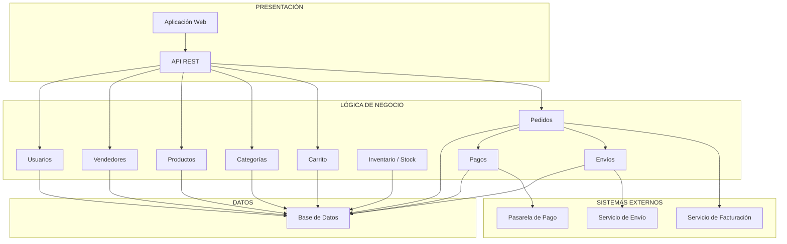

# Arquitectura Inicial del Sistema

## Marketplace E-commerce

La arquitectura inicial del Marketplace E-commerce se organiza en tres capas principales: **Presentación**, **Lógica de Negocio** y **Datos**. Esta separación permite distribuir las responsabilidades del sistema y facilitar su mantenimiento y evolución.

## 1. Capa de Presentación

La capa de presentación permite la interacción de los diferentes usuarios con el sistema.

Está conformada por:

- Aplicación web.
- Interfaz para clientes.
- Interfaz para vendedores.
- Interfaz para administradores.
- API REST.

Los clientes podrán buscar y consultar productos, gestionar su carrito de compra, realizar pedidos, efectuar pagos y consultar el estado de sus compras.

Los vendedores podrán registrar y actualizar productos, gestionar el stock y consultar los pedidos y ventas relacionados con sus productos.

Los administradores podrán gestionar usuarios, vendedores, productos, categorías y pedidos del Marketplace.

## 2. Capa de Lógica de Negocio

La capa de lógica de negocio contiene las reglas y funcionalidades principales del Marketplace.

Los principales módulos son:

- Usuarios.
- Vendedores.
- Productos.
- Categorías.
- Carrito.
- Pedidos.
- Inventario y stock.
- Pagos.
- Envíos.

Esta capa recibe las solicitudes provenientes de la capa de presentación, aplica las reglas de negocio correspondientes y realiza las operaciones necesarias sobre los datos.

También se encarga de coordinar las integraciones con los servicios externos requeridos por el sistema.

## 3. Capa de Datos

La capa de datos es responsable del almacenamiento y consulta de la información utilizada por el Marketplace.

La base de datos almacenará información relacionada con:

- Usuarios.
- Vendedores.
- Productos.
- Categorías.
- Carritos.
- Pedidos.
- Inventario.
- Pagos.
- Direcciones de entrega.

## Sistemas Externos

El Marketplace se integrará con servicios externos necesarios para completar determinadas operaciones:

- Pasarela de pago.
- Servicio de envío.
- Servicio de facturación.

La pasarela de pago permitirá procesar las transacciones realizadas por los clientes.

El servicio de envío permitirá gestionar la información relacionada con la entrega de los pedidos.

El servicio de facturación permitirá generar los comprobantes correspondientes a las compras realizadas.

## Diagrama de Arquitectura en Capas

## Descripción de la Arquitectura

La arquitectura propuesta sigue una organización de tres capas.

La **capa de Presentación** permite la interacción de los usuarios con el Marketplace mediante una aplicación web y una API REST.

La **capa de Lógica de Negocio** contiene los módulos responsables de gestionar usuarios, vendedores, productos, categorías, carrito de compra, pedidos, inventario, pagos y envíos.

La **capa de Datos** permite almacenar y consultar la información necesaria para el funcionamiento del sistema mediante una base de datos.

Además, algunos módulos de la lógica de negocio se comunican con sistemas externos. El módulo de pagos se integra con una pasarela de pago, el módulo de envíos se comunica con un servicio de envío y el módulo de pedidos utiliza un servicio de facturación para la generación de comprobantes.