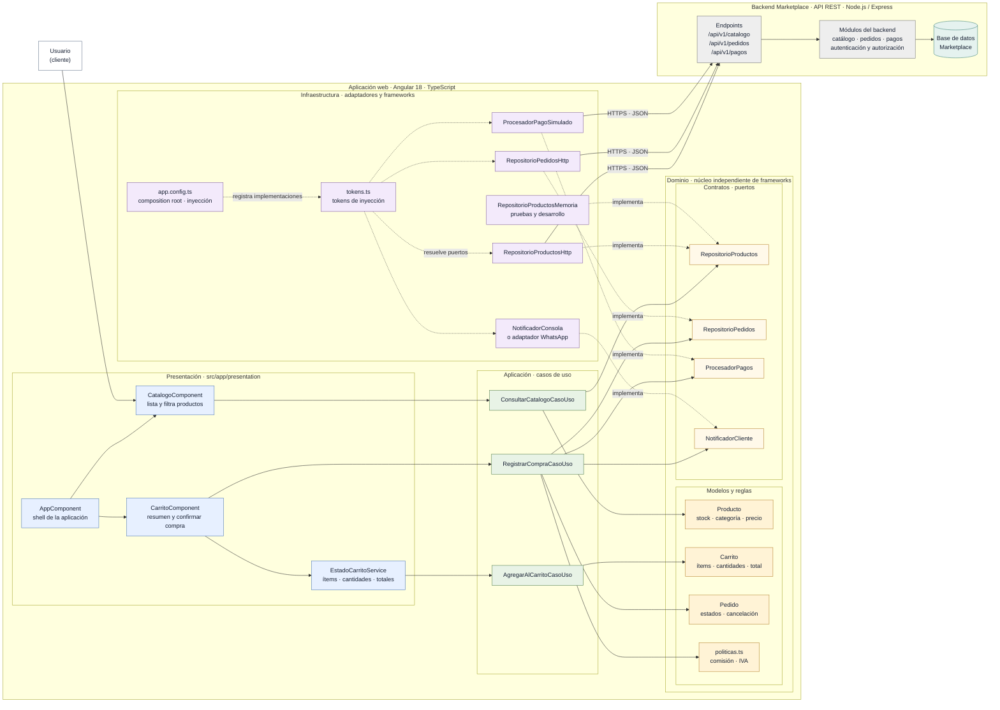

# Enfoque Arquitectónico

## Marketplace E-commerce

### Resumen del enfoque

| Elemento | Descripción aplicada al Marketplace |
|---|---|
| Patrón / enfoque arquitectónico | **Clean Architecture (Arquitectura Limpia)** para la aplicación web Angular, integrada con el backend del Marketplace mediante una API REST. |
| Objetivo | Separar responsabilidades y mantener las dependencias de código dirigidas hacia las reglas del dominio. |
| Problema que resuelve | Reduce el acoplamiento entre la interfaz Angular, los casos de uso, las reglas de negocio y los detalles técnicos como HTTP, persistencia, pagos y notificaciones. |
| Capas definidas | **Presentación**, **Aplicación**, **Dominio** e **Infraestructura**. |
| Beneficios | Facilita mantenimiento y pruebas unitarias; permite sustituir implementaciones técnicas sin modificar las reglas del negocio; mejora la organización y separación de responsabilidades. |

### Diagrama de arquitectura

**Lectura del diagrama:** las flechas continuas muestran el flujo de ejecución entre interfaz, casos de uso y servicios externos. Las flechas punteadas muestran la configuración de dependencias y la implementación de los puertos del dominio por adaptadores de infraestructura. Aunque durante la ejecución un caso de uso utiliza un adaptador, el dominio solo conoce el contrato, no la tecnología que lo implementa.

### Responsabilidades por capa

- **Presentación:** componentes Angular y estado de interfaz. Recibe acciones del usuario, presenta datos y delega operaciones a los casos de uso; no implementa reglas del negocio ni accede directamente a HTTP o persistencia.
- **Aplicación:** casos de uso que coordinan las operaciones del Marketplace, como consultar el catálogo, modificar el carrito y registrar una compra. Depende de modelos y contratos del dominio.
- **Dominio:** entidades, políticas y contratos que expresan las reglas esenciales del negocio. No importa Angular, Express, Sequelize ni bibliotecas de infraestructura.
- **Infraestructura:** implementaciones concretas de los contratos, configuración de inyección, comunicación HTTP, persistencia, pagos y notificaciones. Sus adaptadores pueden sustituirse sin cambiar las reglas del dominio.
- **Backend API REST:** servicio separado del cliente web que autentica y autoriza solicitudes, ejecuta los módulos del Marketplace y persiste la información. El frontend lo consume a través de adaptadores HTTP.

### Reglas de dependencia

1. Las dependencias de código apuntan hacia el dominio: presentación y aplicación pueden usar el dominio; infraestructura implementa sus contratos.
2. Las entidades y políticas del dominio no importan frameworks, servicios externos ni detalles de almacenamiento.
3. Los casos de uso dependen de interfaces del dominio, no de implementaciones concretas como HTTP o una base de datos específica.
4. La composición de implementaciones ocurre en el punto de configuración (`app.config.ts`), mediante tokens de inyección.
5. Las pruebas pueden proporcionar adaptadores en memoria o simulados para verificar casos de uso sin llamadas de red ni servicios reales.

### Beneficios y consideraciones

La separación facilita probar las reglas de negocio de forma aislada, cambiar proveedores técnicos y evolucionar la interfaz sin rehacer el núcleo del sistema. La API REST mantiene desacoplados el cliente Angular y el backend, que pueden desarrollarse y desplegarse de manera independiente.

El costo principal es mantener contratos, adaptadores y configuración de dependencias. Para que la arquitectura aporte valor, las reglas de negocio deben permanecer dentro del dominio y los casos de uso, en lugar de dispersarse en componentes o adaptadores.
