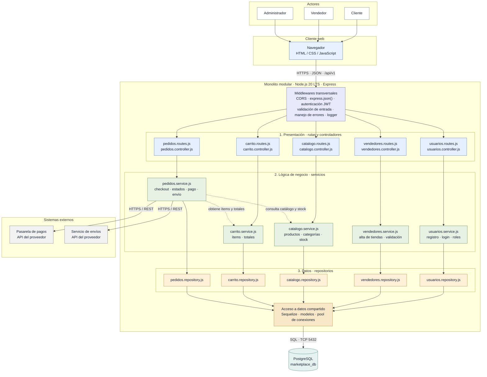

# Estilo Arquitectónico

## Marketplace E-commerce

### Estilo seleccionado: monolito modular en capas

El backend del Marketplace se organiza como un **monolito modular**: usuarios, vendedores, catálogo, carrito y pedidos son módulos funcionales independientes dentro de una sola aplicación Node.js con Express. Cada módulo separa las responsabilidades en rutas y controladores, servicios de negocio y repositorios. Los módulos se despliegan juntos y comparten el acceso a una base de datos PostgreSQL.

El frontend web consume el backend mediante una API REST sobre HTTPS. El backend también se integra con una pasarela de pagos y un servicio de envíos mediante sus API. Esta propuesta mantiene una estructura sencilla para desplegar y operar el sistema, mientras que la separación por módulos facilita localizar cambios y evolucionar las funcionalidades.

La decisión responde especialmente a los drivers de API REST (DA05), seguridad y acceso por roles (DA03 y DA07), e integración con servicios externos (DA04 y DA06). La separación modular y por capas también respalda la mantenibilidad (DA08). El monolito es una decisión inicial: una carga creciente puede requerir escalar instancias y, si los límites funcionales lo justifican, extraer módulos en el futuro.

## Diagrama de arquitectura

Las flechas continuas representan solicitudes y dependencias principales; las flechas punteadas representan llamadas entre servicios de módulos durante un flujo de negocio. Los actores utilizan la misma aplicación web, y el middleware transversal procesa las solicitudes antes de que alcancen las rutas de cada módulo.

## Responsabilidades y reglas

- **Presentación:** expone los endpoints REST y traduce las solicitudes HTTP a operaciones del módulo. Los controladores delegan el trabajo en los servicios; no contienen reglas de negocio ni consultas directas a la base de datos.
- **Lógica de negocio:** implementa las reglas de cada módulo. Los servicios coordinan operaciones entre módulos mediante sus servicios, sin acceder directamente a los controladores o repositorios de otro módulo.
- **Datos:** los repositorios encapsulan las consultas y el acceso a modelos mediante Sequelize. Todos los módulos usan la misma base de datos, pero cada repositorio es responsable de los datos de su módulo.
- **Seguridad transversal:** autenticación JWT, autorización por rol y validación de entrada se aplican en el backend antes de ejecutar las operaciones protegidas.
- **Integraciones:** los servicios de pedidos coordinan el pago y el envío a través de API externas; los detalles del proveedor no deben filtrarse a controladores ni repositorios.
- **Despliegue:** los módulos forman una sola aplicación y se ejecutan en un único proceso por instancia. La comunicación con PostgreSQL y los proveedores externos ocurre a través de sus interfaces definidas.

## Consecuencias de la decisión

La estructura en capas hace explícito el flujo desde la API hasta la persistencia, y los límites de módulo reducen el acoplamiento durante el desarrollo y las pruebas. Al compartir proceso y base de datos, el sistema es más sencillo de desplegar que una arquitectura de microservicios y evita llamadas de red entre módulos internos.

Como contrapartida, los módulos se escalan y despliegan juntos, y comparten los recursos del proceso y de la base de datos. Las dependencias entre servicios deben mantenerse acotadas para que el monolito pueda evolucionar sin convertirse en un bloque difícil de modificar.
